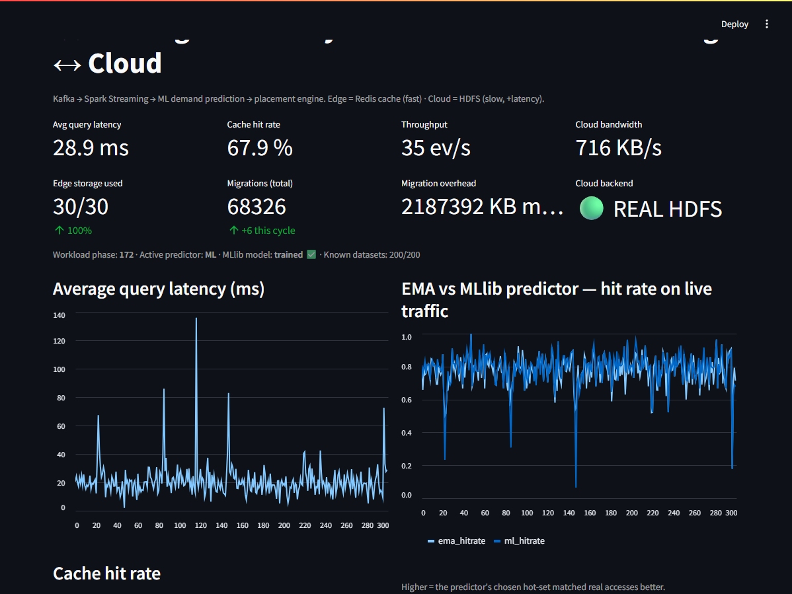

# How It Works — The Complete Guide (explained like you're five, then for real)

> This is the **big friendly manual** for the project
> *"Intelligent Latency-Aware Data Placement & Workload Optimization in Edge-Cloud Systems."*
>
> It is written in **two layers** at every step:
> - 🧸 **Like you're five** — a simple story with toys.
> - 🤓 **For real** — the actual technology, code, and reasons.
>
> Read just the 🧸 parts for the idea. Read both for the full understanding.
> Nothing here assumes you already know Hadoop, Spark, Kafka, or Docker.

---

## Table of contents

1. [The one-sentence idea](#1-the-one-sentence-idea)
2. [The story (toys, bedrooms, and a helpful robot)](#2-the-story)
3. [The real problem this solves](#3-the-real-problem)
4. [Meet every part of the system](#4-meet-every-part-of-the system)
5. [What happens in one round (step by step)](#5-what-happens-in-one-round)
6. [The two "brains" that guess what's hot](#6-the-two-brains)
7. [The exact implementation, file by file](#7-the-exact-implementation-file-by-file)
8. [How to run it (copy-paste)](#8-how-to-run-it)
9. [What you see on the dashboard](#9-what-you-see-on-the-dashboard)
10. [The "it never breaks" trick (fallback)](#10-the-never-breaks-trick)
11. [The numbers we measure and why](#11-the-numbers-we-measure)
12. [How this matches the Big Data Systems syllabus](#12-syllabus-mapping)
13. [Glossary (every scary word, made simple)](#13-glossary)
14. [FAQ & troubleshooting](#14-faq--troubleshooting)
15. [How to give the demo (script to read out loud)](#15-how-to-give-the-demo)

---

## 1. The one-sentence idea

🧸 **Keep the toys you play with a lot right next to your bed, and put the toys
you barely touch in the basement — and have a smart robot keep moving them around
as your favourites change.**

🤓 The system watches how often each piece of data is requested, **predicts which
data will be popular next**, and automatically **moves popular ("hot") data to a
fast nearby store (the "edge")** while pushing **unpopular ("cold") data to a big
faraway store (the "cloud")**. The goal is to answer requests **faster** (lower
latency) and use the network and storage **more efficiently**.

---

## 2. The story

🧸 Imagine your **bedroom**.

- Right next to your bed you have a **small toy box**. You can grab a toy from it
  in **one second**. But it's small — it only holds **30 toys**.
- Down in the **basement** there's a **giant storage room**. It holds **all 200
  toys** you own. But going down to the basement and back takes a **long time**.

Now, you don't play with all 200 toys equally. This week you're obsessed with
**dinosaurs and race cars**. Next week it might be **building blocks**. Your
favourites *change over time*.

Here's the clever bit: there's a **helpful robot** in your room. The robot:

1. **Writes down every single toy you ask for** in a little notebook.
2. **Reads the notebook** to see which toys are your current favourites.
3. **Guesses** which toys you'll want next.
4. **Carries your favourite toys up from the basement into the toy box** by your
   bed (so they're fast to grab), and **carries the ones you've stopped playing
   with back down to the basement** (to make room).

So most of the time, the toy you want is *already right next to your bed* —
**fast!** Only once in a while do you have to wait for a basement trip.

That's the entire project. Now let's name the real pieces.

| In the story 🧸 | In real life 🤓 |
|---|---|
| Toy you ask for | A **data request** (someone reading a dataset) |
| The little notebook of every toy you grabbed | **Apache Kafka** (a log of every access event) |
| The robot reading the notebook & thinking | **Apache Spark** (analyses the access log) |
| The robot **guessing** what's next | **Spark MLlib** (machine-learning prediction) + an **EMA** rule-of-thumb |
| Toy box next to the bed (fast, small) | The **edge** tier = **Redis** (fast in-memory cache) |
| Giant basement storage (big, slow) | The **cloud** tier = **Hadoop HDFS** |
| The robot carrying toys up/down | The **placement engine** (promote/evict) |
| A wall poster showing how well it's working | The **Streamlit dashboard** |
| Each toy/robot/room being its own labelled bin | **Docker** containers |

---

## 3. The real problem

🧸 If you kept **all** your toys in the basement, every playtime would be slow.
If you tried to keep **all** toys by your bed, they wouldn't fit. And if you only
*ever* kept the **same** toys by your bed, you'd be stuck running to the basement
once your favourites changed.

🤓 In real computer systems, data lives somewhere. Two common bad choices:

- **Everything in the cloud:** the cloud is huge and cheap, but it's **far away**,
  so every request travels a long distance → **high latency**, lots of **network
  bandwidth** used, slow apps.
- **Fixed data at the edge:** put some data close to users on small "edge" servers.
  Fast — but if you **never change** what's stored there, you waste the precious
  fast space on data nobody wants anymore, and you keep missing the data they
  *do* want.

This is especially painful in **edge-cloud** setups (think: a phone tower, a shop's
local server, or a small device near the user, all backed by a big central cloud).
The access patterns **shift constantly**. A *static* (never-changing) placement
policy can't keep up.

**The fix:** make placement **dynamic and latency-aware** — continuously learn the
workload and move data to where it'll be fastest to serve. That's what this project
builds and measures.

---

## 4. Meet every part of the system

Here's the whole machine. Each box is a separate **Docker container** (a labelled,
self-contained bin that runs one part).

```
   ┌─────────────┐   "I want dataset X!"   ┌──────────────┐
   │  workload   │ ──────────────────────► │    Kafka     │   the notebook of
   │ generator   │   (access events)       │ access-logs  │   every request
   └─────────────┘                         └──────┬───────┘
        (pretend users)                           │ reads the notebook
                                                   ▼
                              ┌────────────────────────────────────┐
                              │       placement engine (Spark)      │  the robot
                              │  • read events (micro-batches)      │
                              │  • count what's popular (Spark SQL) │
                              │  • EMA guess + MLlib guess          │
                              │  • decide hot set, move data        │
                              │  • serve requests, measure speed    │
                              └───────┬───────────────────┬─────────┘
                       promote hot ↑  │                   │  ↓ read on a miss
                         evict cold ↓ │                   │
                              ┌────────▼──────┐    ┌───────▼────────┐
                              │  Redis (EDGE) │    │  HDFS (CLOUD)  │
                              │  fast, small  │    │  slow, big     │
                              │   ~2 ms       │    │   +80 ms       │
                              └───────┬───────┘    └────────────────┘
                                      │ metrics
                                      ▼
                              ┌───────────────┐
                              │   dashboard   │  the wall poster (charts)
                              │  (Streamlit)  │
                              └───────────────┘
```

Let's go through each one.

### 4.1 The workload generator — *the pretend users*
🧸 A toddler who keeps shouting which toy they want. They have favourites, but
their favourites **change every minute**.

🤓 A Python program that **invents realistic traffic**. It picks datasets using a
**Zipfian distribution** (a few datasets get most of the requests — exactly how
real popularity works: a handful of viral videos get most views). Every ~60 seconds
it **reshuffles which datasets are popular** (the "hot set shifts"). This shift is
the whole point of the demo: it forces the system to *re-learn and adapt*.
It sends each request as a message to Kafka.

### 4.2 Kafka — *the notebook*
🧸 A magic notebook. Everyone writes "I grabbed the red car" into it, and the robot
reads it later. The notebook keeps things in order and never loses a page.

🤓 **Apache Kafka** is a *distributed event streaming platform*. Producers (the
workload generator) **publish** events to a **topic** (`access-logs`); consumers
(the engine) **subscribe** and read them in order. It decouples "who makes requests"
from "who processes them," handles bursts, and guarantees ordered, replayable
delivery. We run it in **KRaft mode** (no separate ZooKeeper needed — simpler).

### 4.3 The placement engine — *the robot* (the heart of the project)
🧸 The robot that reads the notebook, thinks hard about which toys are hot, carries
toys between the basement and the toy box, and hands you toys when you ask.

🤓 A Python program running **Apache Spark in local mode**. Every few seconds it:
1. Pulls a **micro-batch** of recent events from Kafka.
2. Uses **Spark SQL** to aggregate them (count per dataset, last-seen time) — this
   is the *streaming analytics / locality-of-reference* step.
3. Updates an **EMA** popularity score and a **Spark MLlib** prediction.
4. Chooses the **top-K hot datasets** and **reconciles** the edge cache to match
   (promote newly-hot, evict newly-cold).
5. **Serves** each request (edge hit = fast, cloud miss = slow) and records metrics.

### 4.4 Redis — *the toy box by the bed (EDGE)*
🧸 The small, super-fast box right next to you. Grabbing from it is instant, but it
only fits 30 toys.

🤓 **Redis** is an in-memory key-value store — extremely fast (microseconds). We use
it as the **edge tier**: a small, capacity-limited cache (30 datasets) holding the
bytes of whatever's currently hot. It *also* doubles as the place the engine writes
metrics for the dashboard (one fewer moving part).

### 4.5 HDFS — *the giant basement (CLOUD)*
🧸 The huge basement that holds **all** your toys. Reliable, roomy — but slow to
fetch from.

🤓 **Hadoop HDFS** (Hadoop Distributed File System) is the classic big-data storage
layer: a **NameNode** (knows where everything is) plus a **DataNode** (stores the
actual blocks). It's our **cloud tier** — the big, authoritative home for all 200
datasets. Real reads happen over **WebHDFS** (HDFS's REST API). We add a **modelled
+80 ms** to each cloud read to represent the "it's far away" network distance.

### 4.6 The dashboard — *the wall poster*
🧸 A poster on your wall with live charts: "How often is your toy already in the
box? How fast are you getting toys? How many trips did the robot make?"

🤓 A **Streamlit** web app that reads the metrics from Redis and draws live,
auto-refreshing charts. This is your **demo screen** and a core deliverable.

### 4.7 Docker — *the labelled bins that hold everything*
🧸 Each part lives in its own labelled bin so they don't make a mess, and you can
set them all up at once with one button.

🤓 **Docker** packages each service with its exact dependencies. **Docker Compose**
(the `docker-compose.yml` file) starts all of them together on a shared private
network, in the right order, with health checks. One command brings up the whole
distributed system on your laptop.

---

## 5. What happens in one round

Let's trace a **single decision cycle** (this repeats every ~5 seconds, forever).

🧸 **The story version:**
1. The toddler shouts for some toys. Each shout goes into the notebook.
2. The robot reads all the new shouts since last time.
3. For each shout: *is that toy already in the box by the bed?*
   - **Yes** → hand it over instantly (fast! this is a "hit").
   - **No** → run to the basement, grab it, bring it back (slow! a "miss").
4. The robot tallies which toys were shouted for most.
5. The robot updates its **gut feeling** (EMA) and its **smart guess** (the ML
   model) about what'll be popular next.
6. The robot picks the **top 30 toys** it thinks will be hot, carries any missing
   ones up to the box, and carries down the ones that fell out of favour.
7. The robot scribbles the scoreboard onto the wall poster.

🤓 **The technical version** (this is literally `main.py`'s loop):

```
every decision_interval seconds:
  batch         = consumer.poll(...)                 # drain new Kafka events
  for ev in batch:
      latency, hit, bytes = engine.serve(ev)         # edge hit vs cloud miss
      record(latency, hit, bytes)                    # accumulate metrics
      history.append((dataset, ts))
  trim history to the last `window_seconds`
  counts, last_ts = WindowAggregator.aggregate(history)   # Spark SQL groupBy
  ema.update(batch_counts)                           # statistical baseline
  features = build_features(counts, prev, ema, recency, trend)
  ml.add_training_samples(prev_features, counts)     # label last cycle w/ this cycle
  if enough data and time:  ml.train()               # Spark MLlib LinearRegression
  ml_preds = ml.predict(features)
  ema_top  = ema.top_k(K);   ml_top = ml.top_k(ml_preds, K)
  active   = ml_top if ml.ready() else ema_top       # which guess to trust
  recon    = engine.reconcile(active)                # promote/evict = migrations
  metrics.publish(snapshot)                          # → Redis → dashboard
```

The key insight: **placement is predictive**. We don't wait for a toy to be
requested to cache it (that's plain caching). We **predict** the hot set and place
data **ahead of demand**. That's why a good predictor matters.

---

## 6. The two "brains"

We use **two** different ways to guess what'll be hot, and we **race them against
each other** live (the dashboard shows both).

### 6.1 EMA — the "gut feeling" baseline
🧸 *"The toys I grabbed a lot recently are probably still my favourites."* Every
round, a toy's score goes up a bit if you grabbed it, and slowly fades if you
didn't.

🤓 **Exponential Moving Average.** For each dataset: `score = α·(this window's
count) + (1−α)·(old score)`. Recent activity is weighted more; old activity decays.
No training needed. It's a strong, cheap baseline. Code: [`popularity.py`](../services/placement_engine/popularity.py).

### 6.2 MLlib — the "smart learner"
🧸 *"Let me actually learn the pattern: which toys, given how they've been trending,
tend to get grabbed next?"* The robot studies past rounds and builds a little
prediction model.

🤓 **Spark MLlib `LinearRegression`.** For each dataset we build **features**:
`[recent count, previous count, EMA score, seconds-since-last-access, trend]`. The
**label** is *next* window's count (we learn it one cycle later — true supervised
learning). The model learns `demand ≈ f(features)` and we rank datasets by predicted
demand. Code: [`ml_model.py`](../services/placement_engine/ml_model.py).

### 6.3 How we compare them *fairly*
🧸 We don't let either brain peek at the answer. We write down each brain's guess,
*then* see how many of the next toys it got right.

🤓 Each cycle we score each predictor's **previous-cycle** top-K against the batch it
then had to serve (no looking at the current batch first). That's an honest
"did the prediction hold up?" measure. You'll see `ema_hitrate` vs `ml_hitrate`
trade places on the dashboard — a genuine head-to-head.

---

## 7. The exact implementation, file by file

Here is **every file** and exactly what it does.

```
bdsexam/
├── docker-compose.yml          ← defines & wires all containers
├── .env                        ← image versions + project name
├── hadoop.env                  ← HDFS settings (WebHDFS on, replication=1, ...)
├── config/config.yaml          ← ONE place to tune everything
├── docs/
│   ├── architecture.mmd        ← system diagram (Mermaid)
│   ├── data-flow.mmd           ← per-cycle sequence diagram (Mermaid)
│   ├── dashboard.png           ← screenshot of the live dashboard
│   └── HOW_IT_WORKS.md         ← this document
├── scripts/
│   ├── demo.ps1 / demo.sh      ← one-command: build + up + open + tail logs
│   └── bootstrap_hdfs.sh       ← optional manual HDFS check
└── services/
    ├── placement_engine/       ← THE BRAIN
    │   ├── main.py             ← the decision loop (Section 5)
    │   ├── stream_processor.py ← Spark windowed aggregation
    │   ├── popularity.py       ← EMA baseline predictor
    │   ├── ml_model.py         ← Spark MLlib predictor
    │   ├── placement.py        ← serve path + promote/evict (migrations)
    │   ├── hdfs_client.py      ← CloudStore: HDFS + auto-fallback
    │   ├── edge_cache.py       ← Redis edge tier wrapper
    │   ├── metrics.py          ← writes metrics to Redis
    │   ├── seed.py             ← creates the 200 datasets on startup
    │   ├── config_util.py      ← loads config.yaml
    │   ├── requirements.txt    ← pyspark, numpy, kafka-python, redis, hdfs, pyyaml
    │   └── Dockerfile          ← Python + Java + PySpark image
    ├── workload_generator/     ← THE PRETEND USERS
    │   ├── generator.py        ← Zipfian + shifting hot-set → Kafka
    │   ├── config_util.py / requirements.txt / Dockerfile
    └── dashboard/              ← THE WALL POSTER
        ├── app.py              ← Streamlit live charts
        └── config_util.py / requirements.txt / Dockerfile
```

### 7.1 `config/config.yaml` — the control panel
🧸 One sheet of dials. Want a bigger toy box? Faster toddler? Change a number here.

🤓 Central config read by all services. Key dials:
- `edge.capacity` / `placement.top_k` — how many datasets live at the edge.
- `cloud.latency_ms` (80) / `edge.latency_ms` (2) — the speed gap between tiers.
- `placement.predictor` — `ema` | `ml` | `both` (default `both`: use ML once trained).
- `workload.zipf_s`, `hot_set_size`, `phase_seconds`, `rate_per_sec` — traffic shape.
- `cloud.backend` — `hdfs` | `simulated` | `auto` (the fallback policy).

### 7.2 `hdfs_client.py` — `CloudStore` (the reliability hero)
🧸 The basement door. If the basement is locked, the robot uses a **spare basement**
that has copies of everything, so playtime never stops.

🤓 A `CloudStore` class with two interchangeable backends behind one API
(`read`/`write`/`size`/`exists`/`list`):
- **HDFS** via WebHDFS (the real cloud tier), and
- a **latency-injected local-volume store** (the fallback).

On startup it **probes HDFS**; if unreachable and policy is `auto`, it uses the local
store. Crucially, while HDFS is healthy, every `write` is **mirrored** to the local
store too — so if HDFS dies later, the spare already has the data. It also
**re-probes** periodically and switches back when HDFS recovers. This is why the demo
*cannot* die on an HDFS hiccup. See Section 10.

### 7.3 `edge_cache.py` — the edge tier
🧸 The toy box: put a toy in, take a toy out, check if a toy is inside, count toys.

🤓 Thin Redis wrapper. Membership is a Redis **SET** (`lap:edge:members`); each
dataset's bytes live under a key. Methods: `put`, `evict`, `contains`, `members`,
`count`, `clear`.

### 7.4 `stream_processor.py` — Spark streaming analytics
🧸 The robot tallying the notebook: "red car: 12 times, blue train: 9 times…"

🤓 `WindowAggregator.aggregate(events)` builds a real **Spark DataFrame** from the
window's events and runs `groupBy(dataset_id).agg(count, max(ts))`. Genuine Spark
distributed-style aggregation (the *Spark Streaming / locality* component), done as
reliable micro-batches.

### 7.5 `popularity.py` / `ml_model.py` — the two brains
Covered in Section 6. EMA = cheap rule-of-thumb; MLlib = trained `LinearRegression`
over engineered features.

### 7.6 `placement.py` — serving and moving data
🧸 Handing you a toy (and noticing if it was already in the box), plus the robot's
up/down carrying.

🤓 Two responsibilities:
- `serve(ds)` → returns `(latency, hit?, cloud_bytes)`. Hit = `edge_latency`. Miss =
  `cloud_latency + real_read_time` and counts the bytes pulled (bandwidth). Sizes are
  memoized so we don't re-read on every miss (keeps throughput high while staying honest).
- `reconcile(target_hot)` → makes the edge hold exactly the top-K target set:
  promote (cloud→edge copy) the newly hot, evict the newly cold. Every move increments
  **migration count + bytes** (the migration-overhead metric).

### 7.7 `metrics.py` — telling the poster
🧸 Scribbling the scoreboard where the poster can read it.

🤓 Writes a `:latest` JSON snapshot and pushes to a capped `:history` list in Redis,
so the dashboard can draw time series without its own database.

### 7.8 `main.py` — the loop that runs it all
The orchestration in Section 5. Also: seeds data on startup, clears the edge for a
fresh run, retries Kafka until ready, and periodically re-checks HDFS.

### 7.9 `generator.py` — the workload
🧸 The toddler with changing favourites.

🤓 Zipfian sampling over a **reshuffled order** that changes each phase; publishes
JSON events to Kafka and writes the current phase + true hot set to Redis (so the
dashboard can compare "what's truly hot" vs "what we cached").

### 7.10 `app.py` — the dashboard
🧸 The poster with live charts and a green "REAL HDFS" light.

🤓 Streamlit app; `@st.fragment(run_every="2s")` re-reads Redis and redraws metric
cards + line/bar charts + the edge-vs-true-hot-set overlap. (Needs Streamlit ≥ 1.37
for `st.fragment`.)

### 7.11 The Dockerfiles & compose
🧸 The instructions for building each bin, and the master switch that starts them all.

🤓 The engine image is **Python 3.10 (bookworm) + OpenJDK 17 + PySpark from PyPI** —
fully self-contained, no external Spark image needed (Java 17 is what Spark 3.5
supports). Compose wires the private network, health checks, ordered startup, and
volumes. The engine depends only on Kafka + Redis (NOT HDFS) so the fallback can do
its job.

---

## 8. How to run it

🧸 Press one button, wait, then look at the poster.

🤓 **Prerequisites:** Docker Desktop running (~4–4.5 GB free), ~6 GB disk.

**Option A — one command (recommended):**
```powershell
# Windows PowerShell, from the project folder
./scripts/demo.ps1
```
```bash
# Linux / macOS / Git-Bash
./scripts/demo.sh
```
This builds the images, starts everything, waits for the dashboard, opens your
browser, and tails the engine log so you can narrate.

**Option B — manual:**
```bash
docker compose up -d --build      # build + start everything
docker compose ps                 # check all containers are healthy
docker compose logs -f engine     # watch the brain think
```

**Then open in a browser:**
- 📊 Dashboard (the main thing): <http://localhost:8501>
- ⚡ Spark UI: <http://localhost:4040>
- 🐘 HDFS NameNode UI: <http://localhost:9870>

**To stop:**
```bash
docker compose down        # stop everything
docker compose down -v     # ...and also wipe the stored data (fully fresh next time)
```

**First-run note:** the engine spends ~30–60 s seeding the 200 datasets and warming
up the model before the first metrics appear. That's normal.

---

## 9. What you see on the dashboard



🧸 Top row of big numbers = "how's it going right now." The charts below = "how it's
been going over time." The green light = "we're using the real basement."

🤓 Top metric cards: **avg latency, cache hit rate, throughput, cloud bandwidth,
edge storage used, migrations (total + this cycle), migration overhead (bytes), cloud
backend** (🟢 REAL HDFS or 🟡 SIMULATED). A caption shows the **workload phase**,
**active predictor**, and **MLlib status**. Charts:
- **Average query latency** — should be low and dip when hit rate is high.
- **Cache hit rate** — climbs as the engine learns; **dips at each phase shift**,
  then recovers (this is the adaptation story).
- **EMA vs MLlib hit rate** — the two brains racing.
- **Bandwidth & throughput**, and **migrations per cycle** (data-movement cost).
- **Edge vs ground-truth hot set** — how well the cache matches what's truly hot.

**👉 The money moment in your demo:** point at the **cache-hit-rate chart** right when
the workload phase number ticks up. You'll see the hit rate **drop** (the old hot data
is now useless) and then **climb back** within a cycle or two as the engine promotes
the new hot set. *That dip-and-recovery is the entire thesis of the project, visible
live.*

---

## 10. The "never breaks" trick

🧸 What if the basement door jams in the middle of playtime? The robot keeps a
**spare basement** with copies of every toy. If the real door jams, it quietly uses
the spare and you never even notice. When the real door is fixed, it goes back to it.

🤓 The `CloudStore` auto-fallback (Section 7.2). We **tested this live**:
1. While running on **real HDFS**, we ran `docker compose stop namenode datanode`.
2. The engine's next read failed → it instantly switched to `backend=simulated` and
   **kept serving without dropping a single cycle**.
3. We ran `docker compose start namenode datanode`; within ~20 cycles the engine
   **re-probed, found HDFS healthy, and switched back to `backend=hdfs`.**

The dashboard's backend light shows which is active the whole time. This is the
project's reliability guarantee: a flaky HDFS (common on a laptop) can never crash
the demo.

> **Honesty note for your report:** HDFS is *real* and used by default. The simulated
> store exists purely as a safety net and as the "edge vs cloud = latency tiers"
> model. Latency between tiers is *modelled* (a fixed +80 ms for cloud vs +2 ms for
> edge) so the effect is clear and controllable, rather than depending on real
> network jitter. This is a standard simulation technique and is documented openly.

---

## 11. The numbers we measure

🧸 The scoreboard, and why each score matters.

🤓 | Metric | What it means | Why it matters |
|---|---|---|
| **Average query latency** | mean time to serve a request | the headline goal — lower = faster apps |
| **Cache hit rate** | % served from the edge | higher = better predictions, less waiting |
| **Throughput** | requests served per second | the system's capacity |
| **Cloud bandwidth** | bytes/s pulled from cloud on misses | lower = cheaper, less network strain |
| **Storage utilization** | edge slots used ÷ capacity | are we using the fast space well? |
| **Migration overhead** | count + bytes of promote/evict moves | adaptation isn't free — this is its cost |
| **EMA vs MLlib hit rate** | each brain's predictive accuracy | shows whether ML earns its keep |

The trade-off the project explores: **more aggressive migration** can raise hit rate
and lower latency, but **costs bandwidth and overhead**. A good engine finds the
balance — and a good *predictor* gets high hit rate with *fewer* needless moves.

---

## 12. Syllabus mapping

🤓 | Big Data Systems concept | Where it lives in this project |
|---|---|
| Data storage & **locality of reference** | hot/cold classification; promoting hot data near users |
| **Hadoop & HDFS** | the cloud tier (`namenode` + `datanode`, WebHDFS reads) |
| **Distributed architectures** | multi-service edge-cloud design over a Docker network |
| **Apache Spark** | the engine runs on Spark; DataFrame aggregation |
| **Spark Streaming** | windowed micro-batch analysis of the Kafka access stream |
| **Apache Kafka** | real-time access-log ingestion (`access-logs` topic) |
| **ML-based analytics** | Spark MLlib demand prediction vs an EMA baseline |

---

## 13. Glossary

- **Latency** — how long you wait for an answer. Lower is better.
- **Edge** — small, fast storage/compute *near the user*. (Our toy box = Redis.)
- **Cloud** — big, far-away storage/compute. (Our basement = HDFS.)
- **Hot data** — frequently requested data. **Cold data** — rarely requested.
- **Cache hit / miss** — hit = found it in the fast tier; miss = had to fetch from the slow tier.
- **Promote / evict** — move data into the edge / remove it from the edge.
- **Migration** — any such move; it has a cost (bandwidth + time).
- **Kafka topic** — a named stream of messages (our `access-logs`).
- **Micro-batch** — process a small chunk of the stream at a time.
- **Zipfian** — a "few things are very popular, most are rare" distribution.
- **EMA** — Exponential Moving Average; a decaying popularity score.
- **MLlib** — Spark's machine-learning library.
- **HDFS** — Hadoop Distributed File System (NameNode + DataNodes).
- **WebHDFS** — HDFS's REST API for reading/writing over HTTP.
- **Redis** — a very fast in-memory key-value store.
- **Docker / Compose** — packaging + running each service in its own container, all together.
- **Throughput** — how many requests served per second.
- **Bandwidth** — amount of data moved over the network per second.

---

## 14. FAQ & troubleshooting

**Q: The dashboard says "waiting for the placement engine…".**
Give it ~1 minute. The engine seeds 200 datasets and warms up the model first. Check
`docker compose logs -f engine`.

**Q: The backend light is 🟡 SIMULATED, not 🟢 REAL HDFS.**
HDFS was slow/down; the fallback kept the demo alive (by design). It auto-switches
back when HDFS is healthy. Force real HDFS by setting `cloud.backend: hdfs` in
`config/config.yaml` and restarting.

**Q: It uses too much memory.**
Lower `workload.rate_per_sec`, or stop other Docker stacks. The target footprint is
~4–4.5 GB.

**Q: Charts look flat / no adaptation.**
Lower `workload.phase_seconds` (e.g. 30) so the hot set shifts more often, making the
dip-and-recover more visible.

**Q: How do I prove the ML model is real and not faked?**
Open the Spark UI (<http://localhost:4040>) to see jobs running. The engine log prints
`MLlib model trained on N samples (R2=…)` each retrain.

**Q: Reset everything to a clean slate.**
`docker compose down -v && docker compose up -d --build`.

---

## 15. How to give the demo

🧸 A little script to read out loud.

🤓 Suggested 3-minute narration:

1. **"This system makes data access faster by keeping popular data close to the
   user and rarely-used data in the cloud — and it figures out 'popular' by itself,
   in real time."**
2. Show the architecture diagram (`docs/architecture.mmd`). Name the pieces: Kafka
   (the access log), Spark (the analyzer), MLlib (the predictor), Redis (the fast
   edge), HDFS (the cloud).
3. Open the **dashboard**. *"These pretend users are requesting data right now. Watch
   the cache hit rate."* Point out latency dropping as hit rate rises.
4. *"Every 60 seconds, the users' favourites change."* Wait for the **phase number to
   tick**, point at the **hit-rate dip**, then *"…and watch it recover as the engine
   re-learns and moves the new hot data to the edge."*
5. Point at the **EMA vs MLlib** chart: *"We run a simple statistical predictor and a
   trained Spark machine-learning model side by side on the same live traffic to
   compare them honestly."*
6. **The wow finish:** in a terminal run `docker compose stop namenode datanode`.
   *"I'm killing the cloud storage mid-demo."* Show the backend light flip to
   SIMULATED and the metrics keep flowing. Then `docker compose start namenode
   datanode` and show it recover. *"The system degrades gracefully and self-heals."*

That's the whole project — a small, real, self-adapting edge-cloud data platform you
can run on one laptop. 🎉
